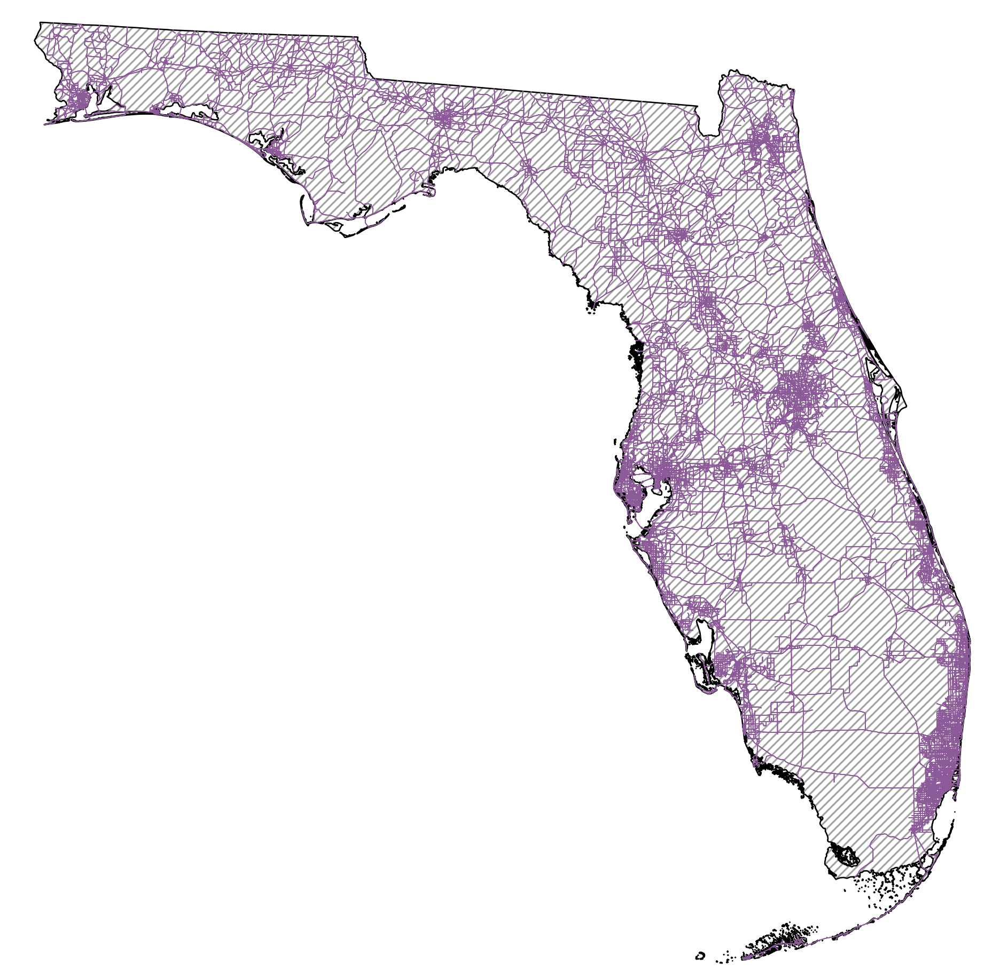
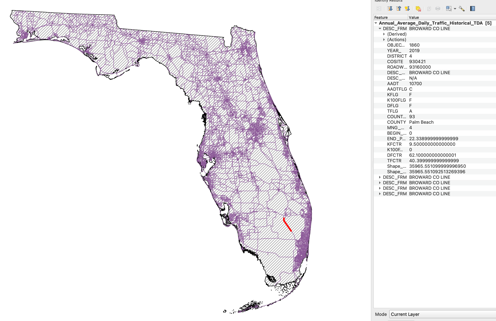
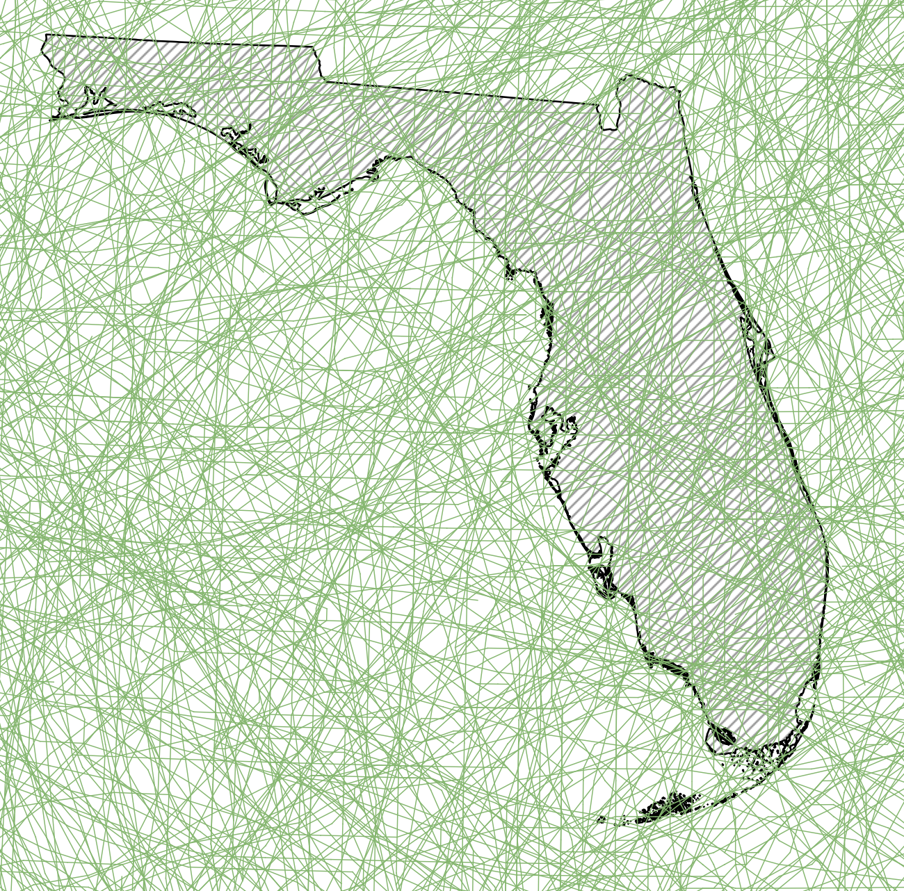
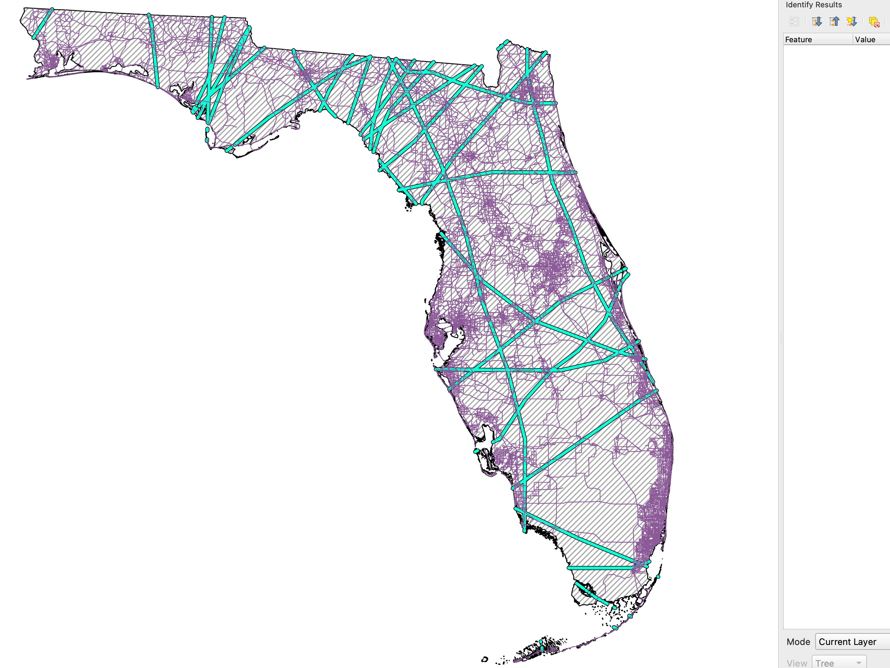

# datasets demo

**Traffic shape map from the dataset: https://gis-fdot.opendata.arcgis.com/datasets/96c6f10bac1b4dd59115d5a5627bbd95_0/about**

Features description for this dataset: [Feature definitions generated by GPT](https://www.notion.so/Feature-definitions-generated-by-GPT-1b687ccc96b280d4871fe7b77618abdd?pvs=21)

**For example: Annual Average Daily Traffic(AADT) for Roadway:93160000 is 10700 (selected in red line)**

**Tropical storm/hurricane shape map(line format) in North America (1851-2024)from dataset:** https://www.ncei.noaa.gov/products/international-best-track-archive

Features description for this dataset: https://www.ncei.noaa.gov/sites/g/files/anmtlf171/files/2025-02/IBTrACS_v04r01_column_documentation.pdf

**Use the Florida state boundary for showing intersections and filter out the tropical storm/ hurricane event happens before 2010, we have the following intersections map only shows event from 2010 to 2024 (including the traffic shape map):**

**For example: One specific hurricane track: SALLY, 2020-9-12 (selected in red line) : https://www.weather.gov/mob/sally**

